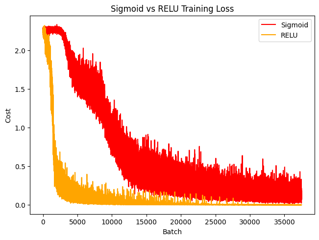

## Custom Backpropagation Implementation with NumPy

### Overview

This project implements backpropagation from **scratch** using only NumPy to train a neural network for classification tasks. It supports networks with any number of layers and allows switching between multiple activation functions. The model achieves **98.1% accuracy** on the MNIST handwritten digit dataset.

### Features

-   Flexible network design: Supports any number of layers and neurons.
-   Multiple activation support: ReLU and Sigmoid functions are implemented.
-   Validated with Gradient Checking: Ensures backpropagation is implemented correctly.

### Backpropagation

In order to implement backprop correctly, many techniques from [Stanford's Lecture on Backpropagation](https://cs231n.stanford.edu/slides/2019/cs231n_2019_lecture04.pdf) were used. The lecture is well written and shows a lot of simplified computation on computing the gradients.

### Training + Architecture

-   Weight Initialization: Uniform distribution within 0.01.
-   Learning rate: 0.01.
-   \[256, 128, 10\] neurons for MNIST classification.
-   ReLU activation for hidden layers, softmax output layer for final predictions.

### Results

Achieved 98.1% on MNIST handwritten dataset.

### Loss Comparison

### Future Ideas

-   Add Adam optimizer for faster training.
-   Experiment with other activation functions like Leaky ReLU or Tanh.
-   Apply more hyperparameter tuning.

### Acknowledgments

-   [**Stanford's Lecture on Backpropagation**](https://cs231n.stanford.edu/slides/2019/cs231n_2019_lecture04.pdf) used for the backpropagation algorithm.
-   [**MNIST Handwritten Dataset**](https://en.wikipedia.org/wiki/MNIST_database) used to train the model.
